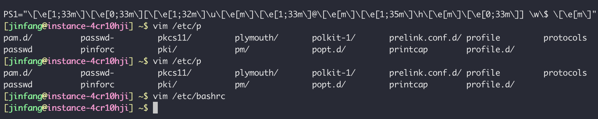
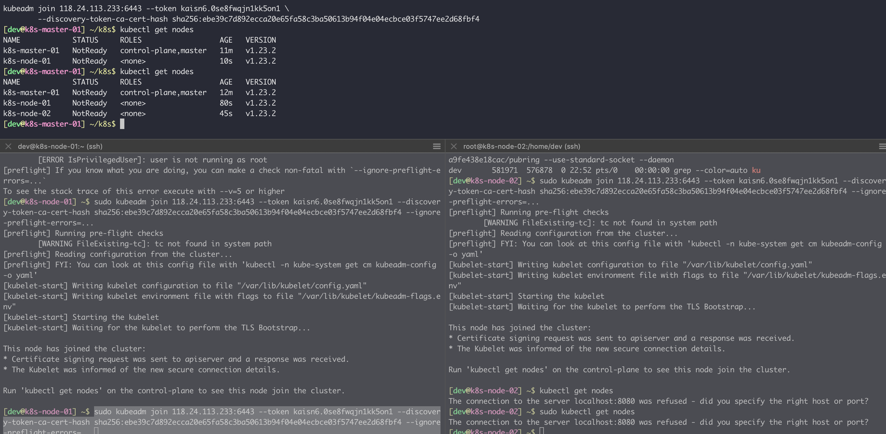

# Kubernetes 集群搭建

## _参考链接_

- [kubernetes生产环境搭建](https://kubernetes.io/zh-cn/docs/setup/production-environment/)
- [kubeadm环境快速搭建](https://kubernetes.io/zh-cn/docs/setup/production-environment/tools/kubeadm/high-availability/)
- [腾讯云部署K8s集群](https://blog.csdn.net/zhang19903848257/article/details/125447578)
- [CentOS 8安装Kubernetes集群详细教程](https://www.seayee.net/2021/09/16/k8s-install/)
- [centos7使用kubeadm安装Kubernetes 1.19版本](https://www.cnbugs.com/post-3190.html)
- [CentOS8安装配置kubernetes（K8S）](https://www.iamlightsmile.com/articles/CentOS8%E5%AE%89%E8%A3%85%E9%85%8D%E7%BD%AEkubernetes%EF%BC%88K8S%EF%BC%89/)
- [k8s集群搭建](http://victorfengming.gitee.io/kubernetes/2_%E6%90%AD%E5%BB%BAK8S%E9%9B%86%E7%BE%A4%E5%89%8D%E7%BD%AE%E7%9F%A5%E8%AF%86/#%E5%A4%9Amaster%E9%9B%86%E7%BE%A4)
- [二进制安装部署k8s高可用集群V1.20](https://www.cnblogs.com/hujinzhong/p/14648961.html)
- [Kubernetes第二篇：从零开始搭建k8s集群（亲测可用）](https://blog.51cto.com/u_15287666/5269619#_1)
- [CentOS8使用kubeadm部署kubernetes](https://zhuanlan.zhihu.com/p/462096658)
- [CentOS8安装Kubernetes1.20.2集群](https://blog.51cto.com/lwm666/2619470)
- [k8s增加master节点](https://zhuanlan.zhihu.com/p/460794489)
- [公网搭建Kubernetes 1.20.9（阿里云+腾讯云）](https://dev-docs.csdn.net/articles/aaf25b1472304763899a88cc75e5152a/kubernetes)
- [公网环境搭建Kubernetes (k8s) 集群的详细图解](https://blog.csdn.net/IT_rookie_newbie/article/details/124992940)


## 前言
为了进一步学习kubernetes 集群搭建尝试自己搭建对应的k8s集群


## 集群设计

### 实例节点
|角色|主机名称|IP|配置|系统|地域|云厂商|相关组件|
|:--:|:--:|:--:|:--:|:--:|:--:|:--:|:--|
|k8s-master|k8s-master-01|118.24.113.233|2C2GB|CentOS 8.2 64bit|成都|腾讯云|TODO|
|k8s-master|k8s-master-02|120.48.102.222|2C4G|CentOS 8.2 64bit|北京|百度云|TODO|
|k8s-node01|k8s-node-01|124.222.67.59|4C16G|CentOS 8.2 64bit|上海|腾讯云|TODO|
|k8s-node02|k8s-node-02|120.48.42.73|4C16G|CentOS 8.2 64bit|北京|百度云|TODO|

### 软件版本

|软件|版本|备注|
|:--:|:--:|:--|
|k8s|v1.23.2||
|kube-apiserver|v1.23.2||
|kube-proxy|v1.23.2||
|kube-controller-manager|v1.23.2||
|kube-scheduler|v1.23.2||
|coredns|v1.8.0||
|etcd|3.4.13-0||
|pause|3.4.1||

k8s1.24版本之后不再使用docker作为容器，因此我们暂不使用该版本，使用1.23.2版本进行安装

TODO 使用container 进行升级替换


## 操作步骤

### 

### 1. 主机基础配置

#### 1.1 控制端颜色
编辑 `/etc/bashrc` 添加如下代码
```bash
# vim:ts=4:sw=4
export HISTSIZE=3000
export HISTTIMEFORMAT="%F %T "
export PROMPT_COMMAND="history -a; $PROMPT_COMMAND"
unset HISTCONTROL


PS1="\[\e[1;33m\]\[\e[0;33m\][\[\e[1;32m\]\u\[\e[m\]\[\e[1;33m\]@\[\e[m\]\[\e[1;35m\]\h\[\e[m\]\[\e[0;33m\]] \w\$ \[\e[m\]"
```
增加控制台颜色和历史命令
显示最终色彩


#### 1.2 增加dev 用户
所有机器新增dev用户并作为k8s 默认用户，可参考[centos8新增用户](https://blog.csdn.net/happy__yun/article/details/124760781)

```bash
# 新增dev用户
adduser dev
# 修改密码 dev@ins47!
passwd dev 

# 修改用户权限
chmod -v u+w /etc/sudoers
vim /etc/sudoers
# 添加
# dev ALL=(ALL) ALL
chmod -v u-w /etc/sudoers
```
### 2. 前置条件
无论node还是master都需要开启的前置条件
#### 2.1 端口开放
为了k8s 机器之间能够正常访问，云控制台开放对应端口如下：

|端口|协议|服务|说明|
|:--:|:--:|:--:|:--:|
|8080、6443|HTTP/HTTPS|kube-apiserver|API专用端口号|
|10252|TCP|kube-controller-manager||
|10251|TCP|kube-scheduler||
|10250、10255|TCP|kubelet||
|2379|TCP/UDP|etcd|客户端访问|
|2380|TCP/UDP|etcd|集群内部访问|
|53|TCP/UDP|DNS|集群DNS|
|8472|UDP|flannel|flannel网络通讯插件使用|
|6443|TCP|k8s-master|k8smaster 端口|
|30000~32767|TCP|node service pod|节点端口服务，如果希望Master的IP也可以访问Pod服务，那么也可以给Master主机开放这些端口（建议）|
|5000|TCP||镜像服务|


#### 2.2 初始化

```bash
## 在K8s中为了高效运行，整个集群的机器需要关闭防火墙、SWAP分区以及Selinuxif
# 1、关闭防火墙 
systemctl stop firewalld 
systemctl disable firewalld 
 
# 2、关闭selinux 
## 服务器均已经默认关闭无需操作
sed -i 's/enforcing/disabled/' /etc/selinux/config  # 永久 
setenforce 0  # 临时 
 
# 3、关闭swap 
## 服务器均已经默认关闭无需操作
swapoff -a  # 临时 
sed -ri 's/.*swap.*/#&/' /etc/fstab    # 永久 
 
# 4、根据规划设置主机名 
hostnamectl set-hostname <hostname> 
 
# 5、在master添加hosts 
cat >> /etc/hosts << EOF 
118.24.113.233 k8s-master-01
124.222.67.59 k8s-node-01 
120.48.42.73 k8s-node-02 
120.48.102.222 k8s-master-02
EOF
 
# 6、将桥接的IPv4流量传递到iptables的链 
cat <<EOF | sudo tee /etc/modules-load.d/k8s.conf
br_netfilter
EOF
 
cat <<EOF | sudo tee /etc/sysctl.d/k8s.conf
net.bridge.bridge-nf-call-ip6tables = 1
net.bridge.bridge-nf-call-iptables = 1
net.ipv4.ip_forward = 1
EOF
sudo sysctl --system  # 生效 
 
# 7、时间同步 
 yum install -y chrony

# 可以修改默认时间同步服务器，https://intl.cloud.tencent.com/zh/document/product/213/40227
# 如 
# server time1.tencentyun.com iburst
# pool 2.centos.pool.ntp.org iburst
#vim /etc/chrony.conf
#systemctl restart chronyd
#systemctl enable chronyd

# 查看时间同步
chronyc sourcestats -v 
``` 

#### 2.3 安装docker

docker k8s 版本兼容情况如下
|Kubernetes版本| Docker 版本兼容情况|
|:--:|:--:|
|1.21.x |v20.10.2 版本以上不兼容|
|1.22.x |v20.10.2 版本以上不兼容|
|1.23.x |v20.10.7 版本以上不兼容|

docker 源添加
```bash
wget https://mirrors.aliyun.com/docker-ce/linux/centos/docker-ce.repo -O /etc/yum.repos.d/docker-ce.repo
```

修改docker cgroup驱动
另外，Kubernetes默认设置cgroup驱动（cgroupdriver）为“systemd“，而Docker服务的cgroup驱动默认值 为“cgroupfs”， 建议将其修改为“systemd”，与Kubernetes保持一致。修改方法为修改/etc/dockere/daemon.json文件（如果没有就添加一个）：
```bash

cat <<EOF > /etc/docker/daemon.json
{
 "exec-opts": ["native.cgroupdriver=systemd"]
}
EOF
```
启动docker 
```bash
sudo systemctl daemon-reload
sudo systemctl restart docker
sudo systemctl enable docker
```

#### 2.4 创建公网网卡
虚拟网卡创建
由于云主机网卡绑定的都是内网 IP, 而且几台云服务器位于不同的内网中（VPC网络不互通）, 直接搭建会将内网 IP 注册进集群导致搭建不成功。

```bash
# 所有主机都要创建虚拟网卡，并绑定对应的公网 ip
# 临时生效，重启会失效
ifconfig eth0:1 <你的公网IP>
 
# 永久生效
cat > /etc/sysconfig/network-scripts/ifcfg-eth0:1 <<EOF
BOOTPROTO=static
DEVICE=eth0:1
IPADDR=120.48.42.73
PREFIX=32
TYPE=Ethernet
USERCTL=no
ONBOOT=yes
EOF

# 重启网卡
# SSH挂掉，从VNC登陆
ifdown eth0 && ifup eth0

```


#### 2.5 安装k8s

k8s 源添加
```bash

cat <<EOF > /etc/yum.repos.d/kubernetes.repo
[kubernetes]
name=Kubernetes
baseurl=https://mirrors.aliyun.com/kubernetes/yum/repos/kubernetes-el7-x86_64/
enabled=1
gpgcheck=1
repo_gpgcheck=1
gpgkey=https://mirrors.aliyun.com/kubernetes/yum/doc/yum-key.gpg https://mirrors.aliyun.com/kubernetes/yum/doc/rpm-package-key.gpg
EOF

setenforce 0

## 移除旧版本
yum remove -y kubelet kubeadm kubectl

## 查看可用k8s 版本
yum list kubelet --showduplicates | sort -r


## 安装指定版本 k8s

yum install -y kubelet-1.23.2 kubeadm-1.23.2 kubectl-1.23.2
## 设置服务开机启动
systemctl enable kubelet && systemctl start kubelet
```


#### 2.6 修改k8s 启动文件
修改kubelet启动参数文件，让其能够从公网进行启动
```bash
# 此文件安装kubeadm后就存在了
vim /usr/lib/systemd/system/kubelet.service.d/10-kubeadm.conf
 
# 注意，这步很重要，如果不做，节点仍然会使用内网IP注册进集群
# 在末尾添加参数 --node-ip=公网IP
ExecStart=/usr/bin/kubelet $KUBELET_KUBECONFIG_ARGS $KUBELET_CONFIG_ARGS $KUBELET_KUBEADM_ARGS $KUBELET_EXTRA_ARGS --node-ip=<公网IP>
```

#### 2.7 初始化节点


```bash

# 初始化节点
sudo kubeadm init \
--apiserver-advertise-address=118.24.113.233 \
--image-repository registry.aliyuncs.com/google_containers \
--kubernetes-version v1.23.2 \
--control-plane-endpoint=118.24.113.233 \
--service-cidr=10.96.0.0/12 \
--pod-network-cidr=10.244.0.0/16 \
--v=5


# 初始化master
mkdir -p $HOME/.kube
sudo cp -i /etc/kubernetes/admin.conf $HOME/.kube/config
sudo chown $(id -u):$(id -g) $HOME/.kube/config
#
sudo chmod u+wr /etc/kubernetes/admin.conf
# 初始化网络
kubectl apply -f "https://docs.projectcalico.org/manifests/calico.yaml"
```

## 结果



```bash
# 配置永久环境变量
cat > /etc/profile.d/kubeconfig.sh << EOF
export KUBECONFIG=/etc/kubernetes/admin.conf
EOF

# 加载环境变量
source /etc/profile

```

### 创建节点

```bash
# 创建节点
kubectl create deployment nginx --image=nginx deployment.apps/nginx created

# 进行测试
kubectl expose deployment nginx --port=80 --type=NodePort
service/nginx exposed

# 查看pod状态
kubectl get pod,svc
```


清空IPtables

```bash
iptables -P INPUT ACCEPT
iptables -P FORWARD ACCEPT
iptables -P OUTPUT ACCEPT
iptables -t nat -P PREROUTING ACCEPT
iptables -t nat -P POSTROUTING ACCEPT
iptables -t nat -P OUTPUT ACCEPT
iptables -t mangle -P PREROUTING ACCEPT
iptables -t mangle -P OUTPUT ACCEPT
iptables -F
iptables -t nat -F
iptables -t mangle -F
iptables -X
iptables -t nat -X
iptables -t mangle -X
```